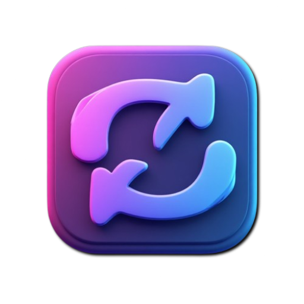

<div align="center">



# rPlay

### Infinite YouTube & Local Media Looper

[](https://github.com/xM3hD1/rPlay/actions/workflows/deploy.yml)
[](LICENSE)
[](#-pwa-installation)

**rPlay** is a fast, lightweight, frontend-only media looper built for music practice, video analysis, and continuous background audio. Play YouTube links or local MP3/MP4 files endlessly with precision A-B repetition controls.

[**Live Demo**](https://xM3hD1.github.io/rPlay/) • [**Report Bug**](https://github.com/xM3hD1/rPlay/issues)

---

</div>

## ✨ Features

- 🔁 **Instant YouTube Looping:** Overrides standard end behaviors using the YouTube IFrame API to play videos back instantly.
- 📁 **Local File Support:** Drag-and-drop local `.mp3`, `.wav`, `.mp4`, or `.webm` files directly into your browser. No files are uploaded to any server.
- 🎯 **A-B Precision Looping:** Set custom start (A) and end (B) timestamps down to the millisecond to loop specific segments.
- ⌨️ **Keyboard Controls:** Full desktop hotkey support for seamless control.
- 📲 **PWA & Offline-First:** Install directly to iOS or Android homescreens for an app-like experience.
- 🔒 **Privacy-First:** Pure static client-side app—zero tracking, zero backend analytics.

---

## ⌨️ Keyboard Shortcuts

| Key | Action |
| :--- | :--- |
| <kbd>Space</kbd> | Play / Pause media |
| <kbd>←</kbd> / <kbd>→</kbd> | Seek backward / forward 5 seconds |
| <kbd>A</kbd> | Set **Point A** (Loop start) to current timestamp |
| <kbd>B</kbd> | Set **Point B** (Loop end) to current timestamp |
| <kbd>L</kbd> | Toggle A-B Precision Loop ON / OFF |
| <kbd>R</kbd> | Reset A-B points |

---

## 🚀 Hosting & Deployment

### Option A: GitHub Pages (Free Frontend)

1. Fork this repository to GitHub.
2. Go to **Settings** $\rightarrow$ **Pages**.
3. Under **Build and deployment**, set **Source** to **GitHub Actions**.
4. Push code to `main` to trigger the deployment automatically.

### Option B: Docker (Self-Hosted Nginx)

If you prefer hosting the static app on your own VPS with custom Nginx, set up `nginx.conf` file on the root folder then:

```bash
# Start container
docker compose up -d --build

# If you have added logging to `nginx.conf` file, view live access logs
tail -f logs/rplay_access.log
```

## 📄 License
Distributed under the **MIT** License. See [LICENSE](/LICENSE) for more information.
